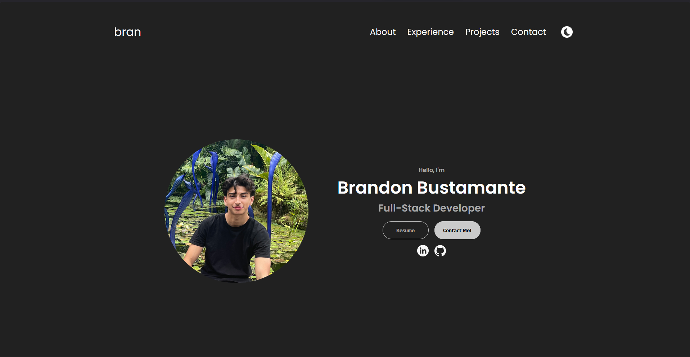

# Portfolio Website: bran.bio

A personal portfolio website showcasing my projects, experience, and the programming languages I am proficient in. Built using HTML, CSS, and JavaScript.

 <!-- If you have a screenshot, update the path accordingly -->

## Features

- **About Me**: A brief introduction about myself and what fuels my passion in the IT world.
- **Experience**: Detailed breakdown of the programming languages and frameworks I have mastered.
- **Project Showcase**: A collection of various projects I've worked on, providing insights into my capabilities.
- **Contact**: Reach out to me! You'll find my email and LinkedIn link for professional connections or inquiries.
- **Responsive Design**: The portfolio is tailored for devices of all sizes.

## Installation & Setup

1. Clone the repository:
```bash
git clone https://github.com/braandoned/bran.bio.git
